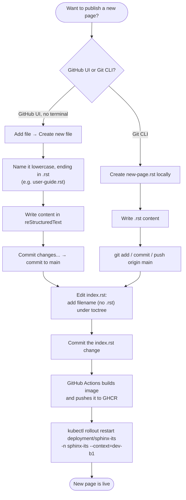
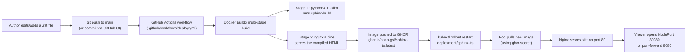

# Sphinx ITS Documentation Website

This repository holds the Sphinx documentation source, Docker build configuration, and Kubernetes manifests for the NOAA GSL Information Technology Services (ITS) documentation portal.

Every push to `main` automatically builds a container image, publishes it to GitHub Container Registry (GHCR), and the image is rolled out to the `dev-b1` Kubernetes cluster.

---

## 1. How to Publish a New Page

Anyone can add a page **without using a terminal**, by editing files directly on GitHub. There's also a command-line path if you prefer Git locally. Either way, the page must be registered in `index.rst` before it will appear on the site.



### Option A — GitHub Web UI (recommended, no command line needed)

**Step 1: Create the new file**
1. Open the repository on GitHub.
2. Click **Add file** → **Create new file**.
3. Name the file in lowercase, ending in `.rst` (e.g. `user-guide.rst`).
4. Write the content using reStructuredText:

   ```rst
   ==================
   User Guide Title
   ==================

   Overview
   --------
   This section provides instructions for standard system operations.

   Key Features
   ~~~~~~~~~~~~
   * **Feature 1**: Description of feature.
   * **Feature 2**: Description of feature.
   ```
5. Click **Commit changes...**, add a message, and commit directly to `main`.

**Step 2: Register the page in `index.rst`**

Sphinx only shows pages that are listed in the `toctree` in `index.rst`.
1. Open `index.rst` → click the pencil icon (**Edit this file**).
2. Add the new filename (without `.rst`), matching the existing 3-space indentation:

   ```rst
   .. toctree::
      :maxdepth: 2
      :caption: Contents:

      overview
      user-guide
   ```
3. Click **Commit changes...** and confirm the commit to `main`.

**How to Reference Subfolder Pages in `index.rst`**

When referencing a file inside a subfolder in your `index.rst` toctree, use relative pathing without the `.rst` extension:

```rst
.. toctree::
   :maxdepth: 2
   :caption: Documentation Sections:

   overview
   user-guides/github-ui
   user-guides/troubleshooting
   architecture/kubernetes-cluster
```

**Step 3: Trigger the live deployment**
1. Open the **Actions** tab and confirm **Build and Push Docker Image** finishes with a green checkmark.
2. Roll out the update to the cluster:

   ```bash
   kubectl rollout restart deployment/sphinx-its -n sphinx-its --context=dev-b1
   ```
3. Refresh the site — your new page appears in the navigation sidebar.

### Option B — Git Command Line

```bash
touch network-guide.rst
# ...write your reStructuredText content into network-guide.rst...

# register it in index.rst under the toctree, then:
git add index.rst network-guide.rst
git commit -m "Add network configuration guide"
git push origin main

# once the GitHub Actions build finishes:
kubectl rollout restart deployment/sphinx-its -n sphinx-its --context=dev-b1
```

A ready-to-use copy of these instructions also lives in [how_to_add_new_files.rst](how_to_add_new_files.rst), which is published as part of the site itself.

---

## 2. Infrastructure at a Glance

| Component | Value |
|---|---|
| Documentation Generator | Sphinx (Python 3.11) |
| Web Server | Nginx (Alpine) |
| Container Registry | `ghcr.io/noaa-gsl/sphinx-its:latest` |
| Kubernetes Cluster | `dev-b1` (`rancher-b1.gsd.esrl.noaa.gov`) |
| Namespace | `sphinx-its` |
| Storage | `vastdata-filesystem` — 10Gi PVC `sphinx-data-pvc` |
| Network Access | NodePort `30080` |
| Image Pull Auth | Kubernetes secret `ghcr-secret` |

### How a change becomes a live page



---

## 3. Repository Structure

```text
.
├── .github/
│   └── workflows/
│       └── deploy.yml            # CI: builds & pushes the Docker image to GHCR on push to main
├── k8s/
│   ├── deployment.yaml           # Runs the pod, mounts the PVC, pulls image via ghcr-secret
│   ├── pvc.yaml                  # 10Gi PersistentVolumeClaim (vastdata-filesystem)
│   └── service.yaml              # NodePort Service exposing port 30080
├── conf.py                       # Sphinx project configuration
├── Dockerfile                    # Two-stage build: Sphinx compile -> Nginx serve
├── index.rst                     # Site homepage + table of contents (toctree)
├── overview.rst                  # Example content page
├── how_to_add_new_files.rst      # In-site copy of the "add a new page" guide
├── requirements.txt              # Python deps: sphinx, sphinx-rtd-theme
└── README.md                     # This file
```

---

## 4. Live Site Access

* **NOAA internal network:** `its.gsl.noaa.gov` 
* **Local cloudflare tunnel routes the application via (port-forward):**

  ```bash
  kubectl port-forward svc/sphinx-its-svc 8080:80 -n sphinx-its --context=dev-b1
  ```

  If you run the container locally browse to `http://localhost:8080`.

---

## 5. Quick Command Reference

```bash
# Check pod/deployment status
kubectl get pods -n sphinx-its --context=dev-b1

# View container logs
kubectl logs -n sphinx-its -l app=sphinx-its --context=dev-b1

# Force the cluster to pull the latest image after a new build
kubectl rollout restart deployment/sphinx-its -n sphinx-its --context=dev-b1

# View the site locally
kubectl port-forward svc/sphinx-its-svc 8080:80 -n sphinx-its --context=dev-b1
```

---

## 6. Technical References

### How to Recreate This Project From Scratch

Follow these steps in order if you ever need to rebuild this repository from nothing.

#### Prerequisites

* A GitHub repository (this project targets `NOAA-GSL/sphinx-its`).
* `kubectl` configured with a context for the target cluster (here: `dev-b1`).
* A Kubernetes namespace to deploy into (here: `sphinx-its`).

#### Step 1 — Create the Sphinx project files

```bash
cat << 'EOF' > requirements.txt
sphinx>=7.0.0
sphinx-rtd-theme>=2.0.0
EOF

cat << 'EOF' > conf.py
project = 'ITS Documentation'
copyright = '2026, NOAA GSL'
author = 'NOAA GSL ITS Team'
release = '1.0'

extensions = []
templates_path = ['_templates']
exclude_patterns = ['_build', 'Thumbs.db', '.DS_Store']

html_theme = 'alabaster'
html_static_path = ['_static']
EOF

cat << 'EOF' > index.rst
==============================
ITS Documentation Portal
==============================

Welcome to the Information Technology Services (ITS) documentation portal.

.. toctree::
   :maxdepth: 2
   :caption: Contents:

   overview
EOF
```

Add at least one content page (`overview.rst`) so the build has something to compile.

#### Step 2 — Write the Dockerfile

A two-stage build keeps the runtime image small: Stage 1 compiles the Sphinx `.rst` sources into static HTML; Stage 2 serves that HTML with Nginx.

```dockerfile
# Stage 1: Build Sphinx static files
FROM python:3.11-slim AS builder
WORKDIR /docs

COPY requirements.txt .
RUN pip install --no-cache-dir -r requirements.txt

COPY . .

# Automatically initialize Sphinx if conf.py is missing, then compile HTML
RUN if [ ! -f conf.py ]; then \
        sphinx-quickstart --quiet -p "ITS Documentation" -a "NOAA" -v "1.0" . ; \
    fi && \
    sphinx-build -b html . _build/html

# Stage 2: Serve via Nginx
FROM nginx:alpine
COPY --from=builder /docs/_build/html /usr/share/nginx/html
EXPOSE 80
```

#### Step 3 — Add the GitHub Actions build/push workflow

Create `.github/workflows/deploy.yml`. This builds the image on every push to `main` and publishes it to GHCR, authenticating with the automatically-provided `GITHUB_TOKEN` (no manual secret needed).

```yaml
name: Build and Push Docker Image

on:
  push:
    branches:
      - main

permissions:
  contents: read
  packages: write

jobs:
  build-and-push:
    runs-on: ubuntu-latest
    steps:
      - name: Checkout repository
        uses: actions/checkout@v4

      - name: Set up Docker Buildx
        uses: docker/setup-buildx-action@v3

      - name: Log in to GitHub Container Registry
        uses: docker/login-action@v3
        with:
          registry: ghcr.io
          username: ${{ github.actor }}
          password: ${{ secrets.GITHUB_TOKEN }}

      - name: Build and push Docker image
        uses: docker/build-push-action@v6
        with:
          context: .
          push: true
          tags: ghcr.io/noaa-gsl/sphinx-its:latest
```

Commit and push. Check the **Actions** tab on GitHub — the workflow should finish with a green checkmark and publish the package under **Packages** on the org/repo page.

#### Step 4 — Decide how the cluster will authenticate to GHCR

GHCR packages are **private by default**. Pick one:

* **Option A — Make the package Public** (simplest for internal, non-sensitive docs sites): Package settings → Danger Zone → Change package visibility → Public.
* **Option B — Keep it Private and use an image pull secret** (used in this repo):

  ```bash
  kubectl create secret docker-registry ghcr-secret \
    --docker-server=ghcr.io \
    --docker-username="<GITHUB_USERNAME>" \
    --docker-password="<GITHUB_PAT_WITH_read:packages_SCOPE>" \
    -n sphinx-its --context=dev-b1
  ```

#### Step 5 — Create the Kubernetes manifests

`k8s/pvc.yaml`:

```yaml
apiVersion: v1
kind: PersistentVolumeClaim
metadata:
  name: sphinx-data-pvc
  namespace: sphinx-its
spec:
  accessModes:
    - ReadWriteOnce
  storageClassName: vastdata-filesystem
  resources:
    requests:
      storage: 10Gi
```

`k8s/deployment.yaml`:

```yaml
apiVersion: apps/v1
kind: Deployment
metadata:
  name: sphinx-its
  namespace: sphinx-its
spec:
  replicas: 1
  selector:
    matchLabels:
      app: sphinx-its
  template:
    metadata:
      labels:
        app: sphinx-its
    spec:
      imagePullSecrets:
      - name: ghcr-secret
      containers:
      - name: sphinx-site
        image: ghcr.io/noaa-gsl/sphinx-its:latest
        imagePullPolicy: Always
        ports:
        - containerPort: 80
        volumeMounts:
        - name: storage-volume
          mountPath: /usr/share/nginx/html/data
      volumes:
      - name: storage-volume
        persistentVolumeClaim:
          claimName: sphinx-data-pvc
```

`k8s/service.yaml`:

```yaml
apiVersion: v1
kind: Service
metadata:
  name: sphinx-its-svc
  namespace: sphinx-its
spec:
  type: NodePort
  selector:
    app: sphinx-its
  ports:
  - port: 80
    targetPort: 80
    nodePort: 30080
```

#### Step 6 — Deploy to the cluster

```bash
kubectl create namespace sphinx-its --context=dev-b1   # skip if it already exists
kubectl apply -f k8s/pvc.yaml -n sphinx-its --context=dev-b1
kubectl apply -f k8s/deployment.yaml -n sphinx-its --context=dev-b1
kubectl apply -f k8s/service.yaml -n sphinx-its --context=dev-b1
```

#### Step 7 — Verify

```bash
kubectl get pods -n sphinx-its --context=dev-b1 -w
```

Wait for the pod to show `1/1 Running`, then test it:

```bash
kubectl port-forward svc/sphinx-its-svc 8080:80 -n sphinx-its --context=dev-b1
```

Open `http://localhost:8080` in a browser.

### Common Pitfalls (learned the hard way)

| Symptom | Cause | Fix |
|---|---|---|
| `InvalidImageName` | `image:` key duplicated (e.g. `image: image: ghcr.io/...`) or an unreplaced placeholder like `<YOUR-GITHUB-...>` | Ensure the manifest has exactly one `image:` line, all lowercase, with the real image path |
| `ImagePullBackOff` | GHCR package is private and the cluster has no credentials | Make the package Public, **or** create `ghcr-secret` and reference it under `imagePullSecrets` |
| Pod stuck in `ContainerCreating` after a rollout | The PVC is `ReadWriteOnce` and an old pod is still holding the volume | `kubectl delete pod -n sphinx-its --context=dev-b1 --field-selector status.phase!=Running` |
